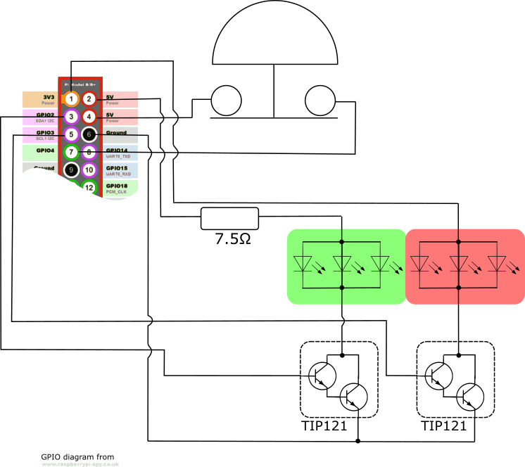

# thebutton
A working model of BBC One's "The Button"

My family and I really enjoyed "The Button" on BBC One this spring and we wanted a way to play the game at home so I decided to try and make a working model of the button from the show. This repo contains the software for the model I made along with links to info about how I built it.

## Building The Button

I have designed two different models of The Button. The first is a fully featured button with an integrated screen and the second is a simpler, cheaper to build model that uses a TV to display the challenges. This video shows both buttons:

### Equipment used

If you want to make your own button you will need access to:
* A Laser cutter
* A 3D printer (ideally one capable of printing ABS)
* A Vacuum-forming machine
* Basic soldering equipment
* A belt or disk sander or a dremmel or similar
* Glue gun

I am a member of [Cambridge Makespace](http://makespace.org/) where I was able to use all of the above equipment to make my buttons.

### Parts list
* 2x 600x400x3mm laser plywood (1 for mini button)
* ABS filament for your 3D printer (for the dome former)
* PLA filament for your 3D printer (for the other parts - can also use ABS)
* 1x Raspberry Pi
* 1x A4 1mm Matt White Styrene sheet
* 1x Raspberry Pi 7" screen (not for mini button)
* 1x Raspberry Pi camera module (optional for big button and not required for mini button)
* 4x M3x12mm screws
* 4x M3 nuts (only for mini button)
* A piece of foam approx 45mm thick and 75mm radius
* Wires
* Veroboard
* 30x very bright red LEDs (10 for mini button)
* 30x very bright green LEDs (10 for mini button)
* 1x 7.5Ω resistor
* 2x TIP121 darlington pair transistors
* Wood glue
* Glue gun glue
* Clear glue or superglue
* Double-sided tape (not for mini button)

### How to
Here is a step by step guide to building the smaller button:

And this video shows the constructions details that differ for the full button:

### Designs
The design files are available on thingiverse:
* The Button
* Mini Button

And this video talks you through the various components of the design:

Here is the wiring diagram, in reality there were more LEDs than are shown:

### Software Installation Instructions

See this video for a walk through of the instructions below:

Starting with a fresh install of "Rasbian with Desktop", open a terminal and clone this repository:

    cd
    git clone https://github.com/burrowsa/thebutton.git

Change directory into the new directory and run the install script:

    cd thebutton
    ./install.sh

The script will set the button software to run at startup as well as configuring your pi to keep the screen on at all times and hide the mouse when inactive. Finally all you need to do is reboot your pi and the software will be running:

    sudo reboot

## Writing Your Own Challenges

The real fun of playing The Button comes from doing the challenges. This repo contains some predefined challenges but you can easily define your own. If you create some fun challenges please submit them as a pull request so others can share in the fun.

All the challenges are defined in the challenges folder. Each challenge is defined in its own file. The file extension must be `.json` and the contents must be valid json. The contents of the file are a list of steps, each step can be one of:
* Display a message on the screen - any string that does not begin with a `!` will be displayed on the screen, e.g. `"hello world"`
* Wait for a period of time - `"!wait:<time-in-seconds>"`, e.g. `"!wait:30"`
* Wait for someone to press the button - `"!button"`
* Set the lights red - `"!red"`
* Set the lights green - `"!green"`
* Start the challenge timer - `"!start"`
* Stop the challenge timer - `"!stop"`
* Show a standard "Challenge Complete" screen including how long the challenge took - `"!challenge complete"`
* Show a standard "Time's up" screen - `"!times up"`

It is also possible to define more complex steps that combine any number of the above elements into a single step, see the challenge files in this repo for examples.

An example of a simple challenge file using four steps, is:

    [
        "Bring me 4 different types of canned food",
        "!start",
        "!button",
        "!Challenge Complete"
    ]

The resulting challenge will work as follows:
* Once the button has beeen pressed the challenge text "Bring me 4 different types of canned food" will be displayed.
* The timer will be started and then nothing will happen until the user presses the button.
* Once the button has been pressed the "Challenge Complete" screen will be shown and will tell the players how it took them to complete the challenge.

## Submissions

I hope you enjoy making your own button and playing the game at home with your friends and families. If you create any challenges or make any improvements to the software or design please submit them back to the project so others can share in the fun.
